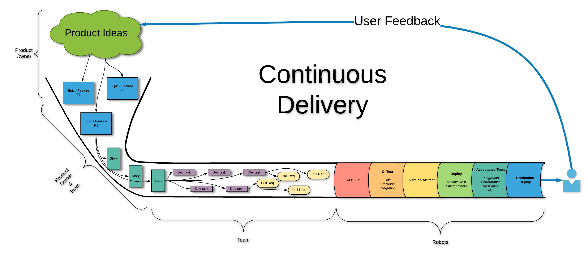

---
authors:
  - bfinster
author: Defense Unicorns Staff
slug: what-is-cd
title: What is CD Really?
date: 2021-07-29
description: Continuous delivery (CD) should be the goal for every software
  team. In this post we explore the benefits of CD and illuminate the common
  pitfalls so you and your team can move forward faster.
category: Continuous Delivery
published: true
image: logo-vertical.png
---
## What is CD?

In modern software development, continuous delivery (CD) refers to the ability to deploy the latest changes on demand. It is common for a single team skilled at CD to deliver changes into production several times per day or week. In organizations using a mature DevSecOps operating model where the whole organization is focused on improving the flow of value delivery, teams can even achieve "continuous deploy." In that practice the pipeline validates individual changes and deploys them directly to production instead of being batched with other changes in a release. Large batches of work are slow to give feedback and contain more defects. In a continuous delivery system, reduced batch size accelerates feedback and significantly improves quality. However, for people accustomed to legacy delivery methods, this can sound terrifying and even unsustainable. When shifting to CD, there is often concern around how to ensure quality and security with the level of confidence the organization has come to accept using less modern, “batched” delivery.  "How can we possibly get our quality assurance processes done that quickly? We'll be breaking things constantly!" In a continuous delivery flow, quality assurance processes are adjusted and integrated into the workflow. Every team is responsible for using feedback from production to continuously improve the quality gates in their pipeline. When done correctly, teams should see their pipeline quality gates as their primary deliverable and use features to validate the quality gates. Because of the focus on improving quality feedback loops, CD is not only safer but also reduces the cost of change and total cost of ownership for product development.

## Why do I need CD?

**In short -- CD is the most effective tool for digital transformation.** The organization is delivering today at the highest level it can with the given structure and goals. Only by discovering what the roadblocks are can the organization improve. CD acts as the engine for broader organizational improvement by exposing opportunities for improvement within the software development lifecycle. When the goal is delivery into production several times a day, the obstacles that prevent frequent delivery are more easily exposed. Those obstacles might be internal to the development team or external, including testing teams and approaches or organizational processes for change and design approvals. CD quickly illuminates unnecessary, dependent workflows and approval processes that create more delivery lag while reducing the safety they are meant to improve.  Importantly, by putting our efforts towards enabling teams to deliver more efficiently, effectively, and sustainably, the entire organization can realign around customer value. 

Continuous delivery is the ultimate expression of agile development and is the reason for a DevOps operating model. If you are on the DevOps journey or want to deliver with more agility, focus on continuous delivery. If you’re interested in learning more about DevOps and DevSecOps, don’t forget to check out our DevOps 101 post here. 

## What are the goals of CD?

Before focusing directly on CD, it is important to understand the underlying concepts behind agile delivery in general. Several methods were developed in the late 1990s to overcome common problems encountered in software development. Agile development methods such as extreme programming (XP), Scrum, etc. were developed to address one or more of the following issues: 

1. The requirements do not reflect what the end-users actually need
2. The requirements were misunderstood
3. The end-users' needs change before delivery occurs

One of the goals of CD is to develop a system of delivery to mitigate these issues. By reducing the size of change, accelerating delivery, and focusing on improving user feedback, software development teams can get rapid feedback on the stability and usefulness of what they are creating. For example, teams focus on building quality gates that efficiently and effectively identify known issues. This gives the team confidence that they are not breaking things while at the same time allowing the delivery of  new changes more rapidly -- and with less cost. This enables us to quickly verify that what we deliver meets the actual needs of the end-user. When it does not, teams have the ability to rapidly change course with much less investment in poor ideas.

Operational stability is another goal of CD. It's common for organizations to establish a delivery method that has layers of process and approvals to "ensure quality". However, when there is a production incident, that process is discarded because it takes too much time. Instead, teams are left inventing a "hotfix" process on the fly where all of the carefully designed quality checks are ignored for the sake of speed. In CD, every change is treated as an emergency change and design a delivery flow that is optimized for operational support. Teams should always use the safest delivery method in an emergency to prevent making a bad problem worse. However, that delivery method must also be fast in order to meet operational goals.

## What does a CD workflow look like?

CD isn't automation. CD uses automation to enable small batches of work. However, how that automation is used is key. Software teams need the correct processes to convert ideas they think are valuable into small changes that can then be delivered to the end-user and feedback received quickly to refine the original ideas. The smaller that loop is and the faster feedback is received, the more waste that can be driven out of organizations and the more successful they become at value delivery.

## I often hear “Continuous Integration” associated with Continuous Delivery. Is it CI/CD or just CD?

It's just "CD". Just as DevSecOps is the organizational operating model that encompasses security, business, compliance, user experience, etc., CD is the practice that encompasses the entire development and delivery process. Continuous integration is the team behavior where all changes on the team are integrated very rapidly and, at a minimum, daily. It's required behavior for a CD workflow, so saying "CD" includes CI.

## What are some common ways to get CD wrong?

### "We will focus on CD after we have a working application." 

In  greenfield development, the ability to deliver is feature zero. If a software team cannot deliver, it cannot verify quality and every change made is only waste. Teams risk developing things that cannot be delivered at all if they don't start with a delivery first approach.

### "We automated the build. We are doing CD." 

CD is how the tools are used. Automating the build is only step 1. How do we continuously harden the flow by adding better quality gates? How can we shorten the cycle time from commit to delivery? How can we reduce the lead time from request to delivery? How can we get more certainty about what needs to be delivered? These are all design and process problems that must be solved to achieve CD.

### "Our users don't want changes that often" 

Users want changes that frequently when things are broken. CD is about operational stability first and feature delivery second. Teams need to know we can fix things quickly. That requires constant practice. The best thing teams have to practice with is the features they are delivering daily. There is also a big difference between generally exposing new features daily and simply delivering changes daily to verify they do not break. Again, this is a quality process, not a feature delivery process. Teams need quality feedback from continuous testing in production instead of hoping their next big release doesn't break anything. Your next big release will break something.

## Do we need smarter people?

No. You have smart people. However, CD is the tool that enables those smart people and the teams they comprise to be more effective. Solving the problem of "why can't we deliver this change safely to production today?" is an engineering problem that takes teamwork and disciplined development. We need to solve the problems of feature flagging, continuous integration, developer-driven testing, effective monitoring and alerting, etc. It also improves morale due to the reduced toil, less Fear Driven Development, improved quality, and improved teamwork.

Want to hear more? We are eager to help your organization accelerate value delivery. Let us know how we can help. [hello@defenseunicorns.com](mailto:hello@defenseunicorns.com)