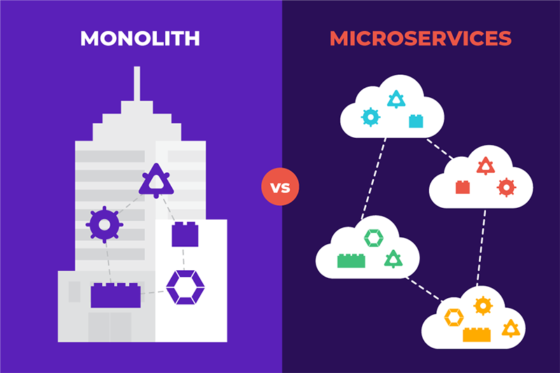

Modern software is moving fast. However, while the associated lexicon is continuously changing, there are core concepts and key terms that one must be familiar with in order to effectively drive digital transformation in their organization. It can be difficult to find these terms and concepts in one place. What’s more, it can be challenging to determine the connections and interrelationships among the concepts. The below is intended to serve as a living guide for those embarking on their own software transformation journey - especially those with a need for cloud-native capabilities. 

Defense Unicorns works with mission-focused partners across the public and commercial sectors. For our public sector partners - particularly those within the Department of Defense - you’ll notice that where appropriate we include additional explanation on how these concepts interact with the Department’s work and strategic priorities. 

**As an organization, we prioritize continuous learning for ourselves and for our partners. Tell us what concepts we’ve missed and we’ll add them here. Get in touch at hello@defenseunicorns.com.** 

### Containers

Containers are packages of software that wrap all dependencies and settings for a given application into a single, fully executable unit. Containerization allows for a single application and all of the components needed to run it (e.g., databases, configurations, default settings, etc) to be isolated and abstracted from the computing environment. This provides flexibility to leverage and deploy applications enterprise-wide, on any infrastructure (i.e., on-premise, cloud, or hybrid), and reduces the risk of vendor-lock with a single cloud service provider. Scaling the use of containers across the Department of Defense can increase software reuse across Components and significantly reduce the overhead burden on developers deploying the applications into production.

### Microservices

In a microservice-based approach to software system architecture, the system is decomposed into many individual software applications that each perform discrete tasks or processes. The individual applications communicate via well-defined application programming interfaces (APIs). Known as “microservices,” each application is fully abstractable from the rest of the system. For example, each microservice has its own, isolated business process flow, logic, data access layer, and codebase. Microservices represent an alternative approach to traditional, monolithic architectures for software systems. By decomposing complex software systems into smaller, self-contained functional units, microservices architectures enhance system reliability and limit the scope and scale of impact when an issue is detected. In this same manner, microservices architectures enable wide, cost-effective scalability and limit the amount of overhead or institutional knowledge required by individual developers. Rather than needing to learn the entire system and its dependencies, developers can work more efficiently, on smaller teams, and focus on ensuring the dependability of an individual microservice. 

*Figure I: A visual comparison of monolithic vs. microservices architectures.*

Within the Department of Defense, enterprise-wide availability of pre-approved, containerized microservices can significantly accelerate software development efforts by making the building blocks of software systems discoverable, available on-demand, and deployable in any computing environment. Given their decoupled nature (i.e., independent of a single system or workflow), microservices are highly composable. They can be configured with other, independent microservices to support workflows and applications tailored to any unique mission. Moreover, microservices that are containerized, configured and managed as a carefully chosen suite of services and functions can serve as pre-assembled software development pipelines that are infinitely scalable.

### Container Orchestration

Container orchestrators automate the deployment and management of containers on any infrastructure. This removes the need to redesign or reconfigure an application in order to deploy it to a different environment. Importantly, container orchestration also enables virtualization and scaling of containerized microservices such as storage, networking, and security which are foundational components of cloud-native applications.  Orchestration tools configure containers based on declared states which indicate how the containers should run. Rather than having to manually redesign or reconfigure an application to run in a different environment, container orchestrators standardize deployments.  

Within the DoD context, containerized microservices and container orchestration can be used to provide a common, but extensible, platform that mission applications can be developed and run on top of. A common, secure platform would allow for better alignment between platform teams and mission application teams. In other words, creating greater standardization among platforms, while preserving the ability to quickly adapt and integrate new products or capabilities, would create a positive feedback loop between mission application teams and platform teams.

### Infrastructure as Code

Infrastructure as Code (IaC) is an approach to managing the technical infrastructure required to run containerized applications. Instead of traditional methods to document procedures, infrastructure as code automates and source controls the configuration of infrastructure. The end result creates a declarative, repeatable configuration that automates the infrastructure provisioning effectively managing it as a single piece of software.

### Configuration as Code

Configuration as Code (CaC) is an approach to managing the configuration of applications’ initial state. Like infrastructure as code, this practice results in a declarative state that can be automated, repeated and managed as a single piece of software.

### Kubernetes

Containers are deployed using container orchestration tools, such as Kubernetes. Kubernetes is an open source container orchestration platform that automates the deployment, scaling, and management of containerized software.

Kubernetes is “infrastructure” agnostic meaning it can be deployed and executed regardless of hardware specifications (i.e., in the cloud, on your laptop, or an air gapped server). IaC and CaC can provide automated provisioning of this infrastructure and the deployment of Kubernetes.

### Declarative State

The combination of Infrastructure as Code, Configuration as Code, and containerized software provide a declarative state. Declarative state is the future of continuous delivery. Kubernetes is among the largest growing ecosystems and its services, support, and tools are widely available.

### Continuous Integration/Continuous Delievery

Continuous delivery (CD) means we have the capability of releasing the latest changes validated by the pipeline to production on demand. Continuous deployment means that every change we make will flow directly to production unless the CD pipeline invalidates the delivery. In either case, a true CD flow will have no human intervention between when code is accepted into the trunk and when it is delivered. Very high performing teams will deliver changes as rapidly as possible. Depending on the delivery context, this could be several times an hour, day, or week. The goal of CD is to minimize risk and cost of change by relentlessly driving down the size of change to expose and correct inefficiencies in the process and improve quality feedback loops. CD is not a technology or tool. CD is how we use the tools to improve quality, organizational efficiency, and customer outcomes.

Continuous integration is the practice of a team of continuously making small changes and integrating them with other changes the team is making to verify that the changes work together and to minimize the risk of conflicting changes between developers. This is a core quality control and is a base requirement for CD. 

### Software FLOW

Software FLOW is middleware software to connect disparate systems, transforming and restructuring data between these systems. FLOW enables complicated data environments, sources, and destinations to interoperate. 

### DevOps

DevOps is the union of people, processes, and products to enable the continuous delivery of value to the end-user. The following are the core principles of DevOps:

1. Systems thinking: optimize the entire system of value delivery
2. Amplify feedback: Strive to get more rapid feedback throughout the system
3. Continuous improvement: Use outcomes to continuously learn and improve

DevOps is neither a tool, a team, nor a role, but is a way of operating where the organization is aligned around more effective value delivery to minimize waste while automating everything possible. This reduces costs and improves delivered quality. The reason DevOps is important is that it enables improved innovation, faster feedback, happier customers, and happier product teams. Learn more about DevOps in our DevOps 101 post, [here](https://www.defenseunicorns.com/blog/20210715-devops-101/).

### DevSecOps

There is no real difference between DevOps and DevSecOps. DevOps is focused on improving the flow of value to the end-user. Insecure software is not valuable because it puts the end-user at risk. DevSecOps was coined in an effort to emphasize that security was core to DevOps.

### Air Gapped Systems

An “air gap” is a cyber security practice commonly employed to enhance a system’s security or defense against cyber events. Air gapped systems are disconnected from the internet and untrusted networks. Critical sectors such as national defense, payments and banking, energy, and aerospace use air gapped systems to improve their cyber security posture for highly sensitive data or transactions. However, air gapped systems present a challenge when they must connect with lower classification systems or servers to exchange data. Most air gapped systems lack run-time monitoring, making it difficult to verify whether a system is adherent to cyber security controls during the data transfer.

### GitOps

GitOps automates infrastructure provisioning for DevOps teams by dynamically updating infrastructure as code configuration files based on events in the DevOps workflow (i.e., version control, collaboration, merge requests, etc.). In this way, GitOps changes the declarative state of the infrastructure based on the activity of the real-time system or application and allows elastic infrastructure management based on demand. This level of automation reduces the traditional manual workload of provisioning infrastructure and integrates infrastructure operations into the DevOps cycle.

### DevSecOps within the Department of Defense- a mini guide 

*For our partners within DoD, below you’ll find a list of common terms and products within the DevSecOps ecosystem. We’ll be adding to this list over time.*

### DoD Iron Bank 

DoD’s Iron Bank repository contains fully accredited container images that are deployable on any infrastructure. Iron Bank makes available industry-leading free and open source software and commercial off the shelf software for DoD customers.

### DoD Platform One Big Bang

Big Bang provides DoD software teams or programs with secure DevSecOps environments that can be customized. Big Bang leverages Infrastructure as Code and Configuration as Code to enable deployment of a declarative platform environment. This consolidates and codifies best security practices into a product that is reliably deployable in a variety of environments.

### Platform One Party Bus

Party Bus is a deployment of core Big Bang for development, testing, and production environments. Party Bus is a declarative state and Party Bus environments benefit from the Platform One continuous authority to operate.